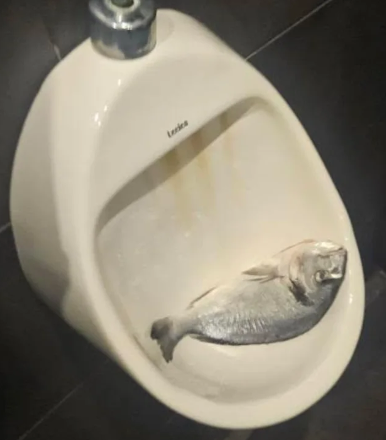

# Urinal Fish



A small Rust Discord bot for planning nights out with friends. It creates event polls in one configured channel, lets people vote with buttons, remembers saved choice sets, and can post recurring event polls on a schedule.

Built with [serenity](https://github.com/serenity-rs/serenity) and SQLite.

## Features

- One-off event polls with `/event`
- Recurring event series with `/recurring`
- Arbitrary poll choices such as `yes,no,maybe,later`
- Reusable choice sets with `/choice_save`, `/choice_list`, and `/choice_delete`
- One vote per user per poll; pressing another button updates their vote
- Locked to one Discord channel through `DISCORD_CHANNEL_ID`
- Docker Compose deployment for a Raspberry Pi
- Local SQLite database stored in the Docker volume
- Basic input hardening for poll text, choices, and template names

## Discord Setup

Create a Discord application and bot in the Discord Developer Portal, then invite it to your server with:

- `applications.commands`
- `bot`

Bot permissions:

- View Channel
- Send Messages
- Embed Links
- Use External Emojis is not required

Copy the IDs for your guild and the channel where the bot should work. Enable Developer Mode in Discord, then right-click the server/channel and use "Copy ID".

## Configure

Copy the example env file:

```sh
cp .env.example .env
```

Edit `.env`:

```env
DISCORD_TOKEN=replace-me
DISCORD_GUILD_ID=123456789012345678
DISCORD_CHANNEL_ID=123456789012345678
DATABASE_PATH=/data/bot.db
DEFAULT_TIMEZONE=Europe/Malta
SCHEDULER_INTERVAL_SECONDS=60
```

## Run

Pull the prebuilt image from GitHub Container Registry:

```sh
docker compose up -d
```

Or build a local image and run that:

```sh
docker build -t urinal-fish:local .
docker compose up -d
```

To run a local build through Compose, temporarily change `image:` in `docker-compose.yml` to `urinal-fish:local`.

Logs:

```sh
docker compose logs -f
```

Stop:

```sh
docker compose down
```

## Publishing Docker Images

The GitHub Actions workflow in `.github/workflows/docker.yml` runs tests and publishes a multi-architecture Docker image to GitHub Container Registry on pushes to `main` and version tags.

The published image name is:

```text
ghcr.io/schembriaiden/urinal-fish-bot:latest
```

For a Raspberry Pi 4, the workflow publishes `linux/arm64`. It also publishes `linux/amd64` for normal servers.

## NixOS Development

Enter the development shell:

```sh
nix develop
```

The shell provides Rust 1.96, `rustfmt`, `clippy`, `cargo-nextest`, `cargo-watch`, `sqlx-cli`, and SQLite tools.

Common commands:

```sh
cargo test
cargo clippy
cargo fmt
```

## Commands

Create a one-off event with default choices `yes`, `no`, `maybe`:

```text
/event title: Drinks Friday when: Friday 20:00 description: Meet outside the pub
```

Create a one-off event with custom choices:

```text
/event title: Food after work choices: pizza,sushi,no,maybe
```

Save a reusable choice set:

```text
/choice_save name: going choices: yes,no,maybe,later
```

Use a saved choice set:

```text
/event title: Beach day template: going when: Sunday 10:00
```

Create a recurring event:

```text
/recurring title: Friday drinks schedule: weekly fri 20:00 template: going
```

Supported recurring schedules:

- `daily 19:00`
- `weekly fri 20:00`
- `friday 20:00`
- `monthly 15 19:30`

List recurring series:

```text
/series_list
```

Stop a recurring series:

```text
/series_delete id: abc12345
```

## Single Pi Deployment

This bot is designed to run as one Docker Compose stack on one Raspberry Pi. The SQLite database lives in `./data` on the host and is mounted into the container at `/data`.

Back up the `./data` directory if you care about preserving old polls, saved choices, and recurring event settings.

## Security Notes

- SQL statements use bound parameters through SQLx instead of string-built queries.
- Commands are rejected outside `DISCORD_CHANNEL_ID`.
- Poll titles, descriptions, "when" text, choices, and template names have length and character validation.
- User-provided `@` mentions are neutralized before the bot reposts text into embeds/buttons.
- The bot needs only Discord bot and slash-command permissions for the configured channel.

## Notes

Slash commands are registered as guild commands when the bot starts, so they should appear quickly. If you change command definitions, restart the container.
